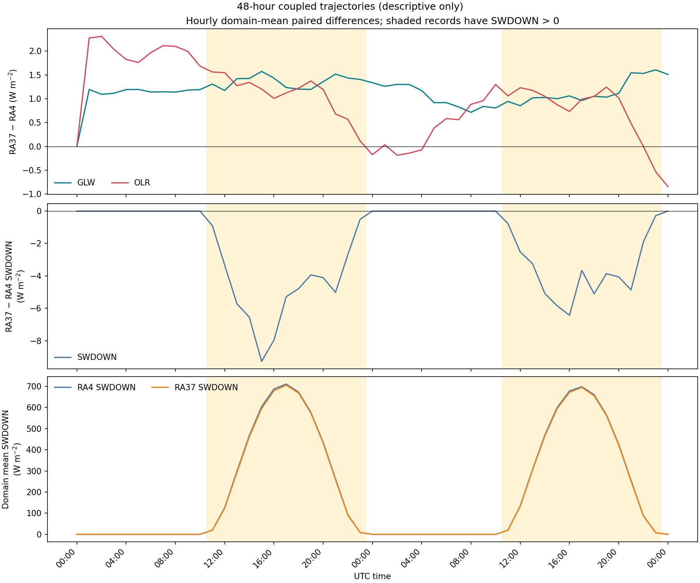

# Matthew 2016 case: timestep and paired-radiation evidence

This package records two fresh, 4-MPI × 2-OpenMP, 48-hour coupled WRF runs on the same 90 × 99 × 44 mass grid and common initial/boundary files. Both runs used `dt=60 s`, radiation every 10 minutes, cumulus every 5 minutes, hourly history, and checkpoints at 12, 24, 36, and 48 hours. The RA4 and RA37 arms each returned 0, had four rank success markers, 49 history records from 2016-10-06 00Z through 2016-10-08 00Z, and four validated restart files.

| Arm | Radiation configuration | Frozen optics |
|---|---|---|
| RA4 | `ra_lw_physics=4`, `ra_sw_physics=4` | off |
| RA37 | `ra_lw_physics=37`, `ra_sw_physics=37` | experimental mode 1, pinned table |

The shared executable is the PR65 copied incremental GNU `em_real` build. It predates PR67 input-location diagnostics and PR68 output-finite guards. The two arms are coupled trajectories with distinct radiation and frozen-optics configuration; their differences are descriptive and do not isolate a same-state radiation operator error or establish forecast accuracy.

The saved 48-hour histories give endpoint-only native vertical Courant maxima of 0.7754 (RA4) and 0.6842 (RA37), both at 2016-10-06 01Z, with no invalid endpoints in the scanned fields. These values use `abs(WW*dt/DNW/(C1F*(MU+MUB)+C2F))` at saved history endpoints and interior interfaces. They do not measure internal Runge–Kutta or acoustic-substep peaks.

The plot below shows paired domain-mean GLW, OLR, and SWDOWN differences plus each arm's SWDOWN. It groups hourly records by whether either arm's saved `SWDOWN` has any positive grid cell. This data-defined grouping is not a solar-zenith classification. Across the 26 SW-active records, RA37−RA4 SWDOWN has mean -4.143 and RMSE 82.777 W m⁻²; GLW has mean 1.246 and RMSE 8.721 W m⁻²; OLR has mean 0.944 and RMSE 16.010 W m⁻². Across the 23 records where both saved SWDOWN fields are zero, the SWDOWN difference is zero; GLW has mean 1.064 and RMSE 7.383 W m⁻²; OLR has mean 1.014 and RMSE 13.114 W m⁻². They remain coupled-state contrasts.

A prior one-hour `dt=60 s` pair covers 00–01Z with 31 records at two-minute intervals. Its saved shortwave fields are zero in both arms. An additive readback validated the existing output files, but the original execution receipt remains `FAIL_PRESERVED`: its runner double-counted success markers duplicated between `rsl.out` and `rsl.error`. No rerun was made and that original receipt was not rewritten. This night-only pair cannot validate daytime shortwave behavior.

A separate `dt=150 s` RA37 run is retained as a failure diagnostic. It stopped at 00:50Z with `RRTMGP_INPUT_DP_HPA_NOT_FINITE`. A saved-endpoint analysis found a maximum finite native Courant value of 2.9533 at 00:42:30; at 00:50, 18,103 of 383,130 endpoint samples were invalid, so the finite-subset maximum at that time is not a whole-record maximum. The history diagnostic uses `abs(WW*dt/DNW/(C1F*(MU+MUB)+C2F))` over interior interfaces and cannot see within-step maxima. This supports timestep sensitivity in these runs, but does not establish the failure's cause or exclude a radiation-port contribution.

The full-history negative-species and number minima/counts are included as report-only diagnostics. For example, RA37 `QRAIN` reached −2.72×10⁻¹⁵ kg kg⁻¹ (923 samples), `QGRAUP` −7.57×10⁻¹⁷ (208), `QNCLOUD` −1.95×10⁻⁶ (1,762), and `QNRAIN` −9.87×10⁻¹¹ (1,490). They describe saved endpoints, not every radiation input or internal stage, and introduce no positivity tolerance. History `T` is dry perturbation potential temperature (`theta_dry−300 K`); negative stored `T` alone is not a negative physical temperature.

## Evidence layout

- `analysis/summary.json` is the compact machine-readable result summary.
- `analysis/paired-diurnal-summary.json` and the figure contain the data-defined day/night descriptive aggregation; `analysis/plot_pair_diurnal.py` reproduces it from the two preserved histories.
- `bundle/dt60-48-hour/` contains the frozen plan, input manifest, preflight/authorization, terminal receipt, comparators, validators, logs, and postflight records for the completed pair.
- `bundle/dt60-one-hour/` preserves the earlier original `FAIL_PRESERVED` receipt alongside the additive readback and descriptive analysis.
- `bundle/dt150/` preserves the failed run, endpoint timeline, corrected thermodynamic derivation, plots, and original logs.
- `evidence-manifest.json` maps each copied/compressed artifact to its original path, byte size, and SHA-256, and has a separate `generated_artifacts` hash/size roster for this README, the summaries, plot, plot source, and verifier source. Large NetCDF outputs are not copied into this package; their original hashes and paths are listed separately.
- `analysis/verify_bundle.py` checks package bytes against that manifest. Use `--check-external` to rehash the original large outputs in place.

Durations, if cited from the receipts, are wall-clock observations of sequential coupled cases on a shared machine, not a controlled RRTMGP performance benchmark. No allocation, gas-optics, cloud-optics, or solver-only performance attribution is made.
