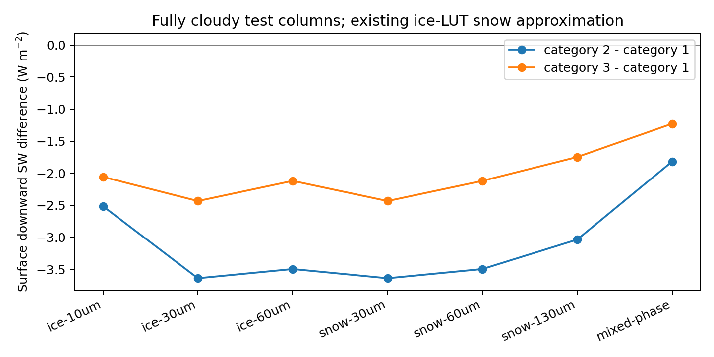
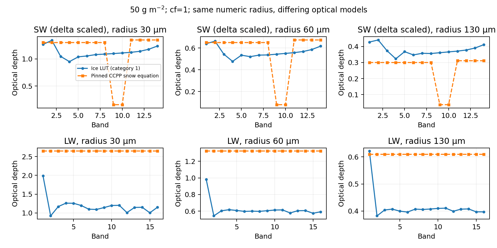

# 기존 RRTMG 비교와 ice/snow 광학 후속 검증

2026-10-02, PR #4 병합 main `4f7d006e` 기준 후속 변경을 GNU 직렬 WRF SCM으로 재빌드·실행했다. **7조건·14개 5분 4/4–37/37 비교가 모두 완료됐고, 이전 포팅 실행의 공통 출력 배열 203–206개가 모든 14개 사례에서 비트 단위로 일치했다.** 새 roughness 기본값 1이 기존 물리 결과를 보존한다. 공식 수정 전 WRF와의 실행 회귀 비교는 아니다.

기존 RRTMG와의 차이는 [앞선 상세 보고서](../rrtmg-comparison/REPORT_ko.md)의 수치와 같다. 같은 초기 상태에서 5분 평균 37−4 지표 하향 SW는 청천 −0.80 W/m², 기본 Lin 구름 +52.03, WSM5 혼합 +34.46, Ferrier 혼합 +53.48 W/m²다. WSM5의 OLR 차이는 +22.75~24.44 W/m²다. 이 결과는 구현 간 차이이며 관측 오차나 정확도 우열을 뜻하지 않는다. 이번 바이너리의 [JSON](rrtmg-comparison.json)과 [CSV](rrtmg-comparison-metrics.csv), [기존 포팅 회귀](previous-port-regression.json)를 별도로 저장했다.

## 이번 코드 변경

- 전역 namelist `rrtmgp_ice_roughness=1/2/3`을 Registry와 초기화에 연결했다. LW/SW 모두 LUT load 후 명시 설정하고, 범위 오류·초기화 후 변경을 거부한다. 기본 1은 이전 결과 보존을 위한 선택이다. 고정 UFSATM의 기본 3과 reference example의 2를 구분한다.
- V2 컬럼 capture에 roughness를 기록하고 독립 reference에 전달했다. 기존 V1 capture는 당시의 1로 재생한다. 실제 WRF의 cloudy WSM5 5분 실행에서 roughness 2·3의 LW/SW 광학·mask는 독립 계산과 정확히 일치하고, 플럭스·가열률은 float32 반환 허용오차 안에서 일치했다. 같은 고정 라이브러리·분광자료를 공유하므로 독립 분광 정확도 평가가 아니다.
- 1/2/3 민감도, CF-only maximum-random의 transparent-layer 상관, 컴파일 설정 변경에 따른 객체 재빌드·명시 archive 목록 시험을 추가했다. Snow에는 기존 ice LUT를 계속 사용하며 비교 실행 파일에서 별도 CCPP 식과 대조했다.

## Roughness 민감도

한 시험 기둥은 3층 모두 cf=1이며 ice-only/snow-only는 각 층 50 g/m², mixed는 LWP/IWP/SWP=20/50/30 g/m²다. 아래는 ncol=1 지면 하향 SW(W/m²)다. 같은 설정을 ncol=8/64에서도 실행했지만 WRF 자체의 packing 구현을 뜻하지 않는다.

| 입력 | category 1 | category 2 | category 3 |
| --- | ---: | ---: | ---: |
| 청천 | 625.407 | 625.407 | 625.407 |
| 액체만 | 166.492 | 166.492 | 166.492 |
| 빙정 반경 30 μm | 248.501 | 244.861 | 246.067 |
| 눈 반경 60 μm, 현재 ice LUT | 356.273 | 352.777 | 354.153 |
| 혼합 수상 | 147.354 | 145.534 | 146.124 |

청천·액체 결과의 category 불변성과 빙정/눈 SW 반응, 독립 flux-divergence 가열률 관계를 검사했다. 어느 roughness가 실제 대기에 더 정확한지 이 시험으로 고르지 않는다. CSV [1](ice-roughness-1.csv)·[2](ice-roughness-2.csv)·[3](ice-roughness-3.csv)와 [검사 JSON](ice-roughness-summary.json)이 있다.

## Ice LUT와 CCPP snow 식

[고정 소스·계수·단위 검토](../../../WRF/doc/rrtmgp/OPTICS_COMPARISON.md)를 참고한다. SW 14-band 배열은 소스에서 기계적으로 추출해 비교했다. [계수 검증](ccpp-snow-coefficient-source-check.json)의 c0s는 1–10=.970, 11–14=.700이다.

cf=1, SWP=50 g/m², 같은 수치 반경을 입력한 별도 광학 비교에서 현재 ice LUT와 CCPP snow 방정식은 밴드 구조가 달랐다. 반경 30 μm의 LW τ는 ice LUT(category 1)에서 밴드별 0.9231–1.9863, CCPP 식에서는 전 밴드 2.6439였다. **이는 실제 플럭스 오차가 아니라 광학모델 비교다.** CCPP 방정식은 배정도로 재계산했으며 CCPP host executable의 비트 단위 결과를 주장하지 않는다.

입력 반경 130 μm의 ice LUT 직경은 260→180 μm로 clip되고 CCPP 식은 반경 130 μm를 그대로 쓴다. 따라서 아래 차이에는 광학식과 범위 정책이 함께 들어 있다. PSD/유효크기 정의, in-cloud 경로·발생 분율까지 일치시킨 NOAA 재현 시험은 후속 작업이다. Rain/graupel 이식도 이번 범위에 포함하지 않는다. [360행 CSV](snow-optics-source-comparison.csv)에서 input/used diameter와 raw/delta-scaled τ/SSA/g를 구분한다. LW 흡수 전용의 해당 없는 SSA/g는 NaN으로 표기한다.

## Transparent layer와 빌드

2,048개의 분산된 고정 시드에서 바깥 두 층의 동시 cloudy 비율은 중간 cf=0일 때 LW .249462/SW .250964, 중간 cf=.5이면서 path=0일 때 LW .499901/SW .500157였다. 현재 CF-only 연속성 계약을 확인한 결과이며, path-aware gap으로 바꿔야 한다는 물리 판단은 별도다. [원시 통계](transparent-overlap.txt).

Make 고립 시험에서 clean=25개 컴파일/6개 archive, 같은 설정 반복=0/0, FCFLAGS 변경=25/6, 반복=0/0을 확인했다. 삭제된 object 목록을 정리하고 dummy.o를 archive 입력에서 제외했다. [빌드 검증](make-reproducibility.json). 전체 WRF Registry 변경은 오래된 생성 타입을 재사용하면 안 되므로 생성 객체·모듈을 정리한 표준 전체 SCM 재빌드로 확인했다.

전체 독립 CTest **38/38**, Registry의 등록 전후 warning **56/56**, 새 GNU 직렬 WRF 빌드, 동일 입력 14 SCM, roughness 2·3 WRF replay가 통과했다. [검증 기록](validation.json)에 바이너리 SHA256과 범위를 저장한다.

Snow 생산 경로 이식, g/cp/분자량 통일, 희박한 cf의 장시간·공간 통계와 seed 정책, 제외 질량·clip의 예보 전체 통계, 음수 수상체, MPI/OpenMP/restart/nest/24–48 h 예보 및 성능 최적화는 남아 있다.
