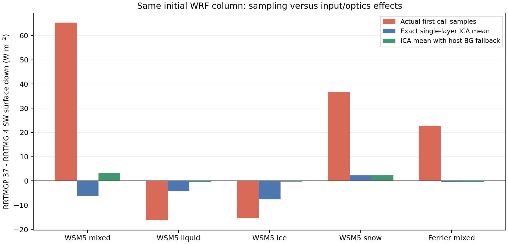

# RRTMG 4–RRTMGP 37 차이의 포팅 오류 심층 감사

2026-10-02에 PR #5 head `3a69404fbe06486fcaad7ba063d3d8062dc8f2a4`를 감사했다. 원격 main은 `4f7d006e5f378ac8f151c5318172d84ef23c5e5a`였다. 기준 head의 GitHub CI 5개 작업은 모두 PASS였다. 아래의 인과 분해는 수정 전 이 head를 대상으로 한 결과이며, 이후 적용한 배경 반경 보완의 검증은 마지막 항목과 validation.json에 별도로 기록한다.

감사 중 PR #5가 병합되어 원격 main은 `6d03197`로 갱신됐다. 병합본과 감사 기준 head의 Git tree는 `f5df9403a5daf29b4681f472c9df901745c90932`로 동일하다. 이번 배경 반경 패치는 그 병합본 위의 별도 변경이다.

## 판단

**실제 host 입력 연결 결함 1개를 확인했다.** WRF의 초기 배경 유효반경을 미세물리의 유효한 진단 반경으로 간주한 것이다. RRTMGP 코어의 압력 단위·상하 순서·반경/직경 변환·가열률/온위 반환의 산술 오류는 이번 시험에서 발견하지 못했다.

동시에 기존의 큰 순간 플럭스 차이를 모두 포팅 오류라고 해석할 수 없다. 같은 초기 혼합 구름 기둥에서 관측된 SW 하향 차이 **+65.30 W/m²**는 단일 McICA 표본 차이 **+71.42**와 두 엔진의 표본 기대값 차이 **−6.12**의 합이다. 초기 반경 결함과 표본 오차가 함께 있었으며, 부호도 다를 수 있다.

이 수치는 **첫 호출의 i=1,j=1 한 기둥**이다. 앞서 보고한 5분 적분의 전체 격자 평균 +52.03/+34.46 W/m²와 직접 같다고 주장하지 않는다. 그 장시간 차이에 대한 동일 상태별 분해는 아직 수행하지 않았다.

## 방법과 증거의 독립성

1. 기존 GNU 직렬 WRF 실행 파일의 전처리 직후에 읽기 전용 포획 함수를 넣은 고립된 실행 파일을 만들었다. 변경한 전처리 `.f90`, `.o`, `.mod`는 scratch directory에 두고 production 파일은 수정하지 않았다.
2. 7조건에서 같은 wrfinput의 변수 배열과 같은 forcing을 복사해 4/4와 37/37을 각각 1분 실행했다. **14개 실행 모두 상태·복사 경향의 유한성 검사와 정상 완료를 통과**했다. 포획용 실행 파일의 공통 history 변수 203–206개는 기존 정상 5분 실행의 첫 1분과 모든 사례에서 비트 단위로 같았다.
3. 실제 두 wrapper가 받은 기압·온도·6기체 VMR·CF·지표 온도·알베도/방출률·solar/mu0를 비교했다. **14개 LW/SW 포획에서 해당 공통 입력의 최대 절대 차이는 0**이다. LW의 CFC 원래 입력도 동일했으나 37의 6기체 어댑터에는 전달되지 않는다.
4. 같은 입력에서 clear와 fully-cloudy 상태를 강제한 **28개 10초 WRF 실행**을 추가했다. WRF의 정상 계수 로딩/초기화를 그대로 사용하는 실제 RRTMG 코어를 호출했다. full-cloud 조건에서는 원래 in-cloud 경로를 그대로 유지하고, 모든 g-point의 mask와 sampled water paths를 다시 만들었다. CF를 1로 바꾼 뒤 경로를 다시 나눠 질량을 바꾸는 시험이 아니다.
5. 최초 cloudy 상태에는 양의 CF 층이 하나뿐이므로 각 엔진의 정확한 ICA 표본 기대값을 `(1-f)*Fclear + f*Fcloudy`로 계산할 수 있다. 가열률도 같은 선형 결합으로 계산했다. 다층 maximum-random의 일반 공식으로 확대하지 않는다.
6. 37의 같은 clear/full-cloud 계산과 반경만 바꾼 계산은 WRF adapter를 링크하지 않은 독립 `reference_column` 실행 파일로 재생했다. 총 70개 variant를 실행했고, WRF 조건부 결과는 독립 재생 결과와 단정도 반환 허용 오차 안에서 일치했다. 라이브러리와 계수는 같은 핀이므로 분광 물리의 독립 관측 검증은 아니다.

별도의 직접 RRTMG standalone smoke는 SW에서 종료 오류가 남아 결과를 채택하지 않았다. 아래 RRTMG 수치는 그 실행에서 나온 값이 아니라, 정상 초기화와 실행을 통과한 WRF 포획/조건부 실행에서 나온 값이다.

자료: [공통 입력/계층별 반경](paired-inputs.json), [ICA 분해](causal-decomposition.json), [반경 counterfactual](radius-counterfactual.json), [CSV](causal-metrics.csv), [실제 포획 ZIP](baseline-captures.zip). 전체 초기 상태와 로그 경로·해시는 실행 receipt에 기록했다.

## 확인한 P1 결함: 반경 제공 capability와 유효 진단의 혼동

[WRF 상수](../../../WRF/share/module_model_constants.F#L62)는 배경 반경을 액체 2.49, 빙정 4.99, 눈 9.99 μm로 정의한다. [physics_init](../../../WRF/phys/module_physics_init.F#L1072)의 `has_req*`는 해당 미세물리/설정이 반경 필드를 제공하는지를 나타낸다. 이어서 [초기화](../../../WRF/phys/module_physics_init.F#L1358)가 필드에 배경값을 채우며 [WSM5](../../../WRF/phys/module_mp_wsm5.F#L219)가 나중에 실제 크기를 계산한다.

그런데 수정 전 37 wrapper는 flag만 보고 이미 준비한 host fallback을 원래 source 값으로 덮어썼다. 최초 cloudy 기둥의 실제 원래 필드는 정확히 `RE_*_BG`였으므로, 이것은 비정상 가상 입력만의 문제가 아니다.

| 최초 WSM5 cloudy layer 47 | RRTMG 4의 host 입력 | 수정 전 RRTMGP 37의 host 입력 |
|---|---:|---:|
| 액체 반경 | 7.5 μm, land fallback | 2.49 μm, 초기 BG |
| 빙정 반경 | 83.75517 μm, 온도 진단 | 4.99 μm, 초기 BG |
| 눈 반경 | 10 μm | 9.99 μm |
| 혼합 LWP | 40.41186 g/m² | 동일 |
| 혼합 IWP | 20.20593 g/m² | 동일 |
| 혼합 SWP | 60.01161 g/m² | 60.61779 g/m², legacy 0.99 제거 |

RRTMGP의 ice optical input은 effective diameter이므로 실제 WRF 경로에서 `2*r`를 적용하는 것은 맞다. WRF wrapper가 backend에 flag=4를 넘기므로 Fu `/1.0315` 분기는 실행되지 않는다. 초기값을 잘못 유효값으로 고른 것은 그 앞 단계의 host 상태 계약 문제다. [공식 cloud optics 입력 정의](https://earth-system-radiation.github.io/rte-rrtmgp/reference/rrtmgp-fortran-interface/sourcefile/mo_cloud_optics_rrtmgp.f90.html).

기체·경로·표본·CF를 고정하고 BG만 기존 host 반경으로 보완한 독립 계산에서:

| 첫 기둥 | 단일 실제 표본 SWDOWN 변화 | 정확한 ICA 평균 변화 |
|---|---:|---:|
| WSM5 ice-only | +10.91100 W/m² | +7.31348 W/m² |
| WSM5 liquid-only | +3.82280 | +3.76200 |
| WSM5 mixed | +5.38519 | +9.37133 |
| WSM5 snow-only | +0.00771 | +0.01466 |

ice-only의 조건부 완전 구름 결과는 +401.35 W/m² 차이다. 이는 같은 큰 **in-cloud** 경로를 가진 완전 구름 기둥의 민감도이고, 실제 격자 평균이나 예보 오차 401 W/m²를 의미하지 않는다.

이전 A→B 검사기는 `source radius*1e6`의 전달 자체를 기대값으로 두었으므로 이 결함을 통과시켰다. 올바른 RTE replay가 잘못 선정된 host 입력의 물리적 의미까지 보증하지 않는다는 구체적 사례다.

적용한 패치는 양의 수분량·CF가 있는 층에서 source가 해당 **정확한 BG 상수**일 때만 기존 `recloud1d/reice1d/resnow1d`로 보완한다. 정상 source 반경, 질량, CF, seed, Fu/diameter 정책, RRTMGP LUT clipping은 보존한다. CAM-MGMP의 별도 반경 override는 이후에 그대로 적용한다. 실제 미세물리 하한값이 BG와 정확히 같으면 초기 placeholder와 구별되지 않으며 같은 host fallback을 따른다는 제한이 있다.

## 큰 순간 차이의 인과 분해

값은 첫 i=1,j=1 기둥의 지표 하향 단파, 모두 37−4 W/m²이다. ICA 열에는 물리 모델과 host 입력 선택의 차이가 함께 있다. sampling 열은 각 실제 표본이 자기 엔진의 ICA 기대값에서 벗어난 값의 차이다.

| 사례 | 관측 차이 | ICA 기대값 차이 | sampling 차이 | BG 보완 후 ICA 차이 |
|---|---:|---:|---:|---:|
| 청천/MP2 초기 | −0.51904 | −0.51904 | 0 | −0.51904 |
| WSM5 mixed | +65.29553 | −6.12112 | +71.41665 | +3.25020 |
| WSM5 liquid-only | −16.27094 | −4.29337 | −11.97757 | −0.53137 |
| WSM5 ice-only | −15.39984 | −7.58465 | −7.81519 | −0.27117 |
| WSM5 snow-only | +36.69489 | +2.25341 | +34.44148 | +2.26807 |
| Ferrier mixed, MP5 | +22.84344 | −0.39485 | +23.23829 | −0.39485 |

혼합층의 CF는 양쪽 모두 0.094854586이지만 SW의 cloudy g-point는 4가 12개, 37이 8개였고 선택된 spectral points도 달랐다. 단순 개수 비율만으로 복사 기여를 환산할 수 없다. 동일 초기 상태나 같은 정수 seed는 다른 난수기·g-point 배치의 동일 표본을 보장하지 않는다. AER도 McICA column의 통계적 평균과 공간·시간 표본의 역할을 설명한다. [AER RRTMG_SW](https://github.com/AER-RC/RRTMG_SW).

같은 날짜에 표본을 고정하는 현재 37 정책에서는 시간 평균만으로 오차가 소거된다고 보장할 수 없다. 그렇다고 이번 기둥의 큰 순간 차이가 RRTMGP 엔진의 체계적 +65 W/m² 편향이라는 뜻도 아니다. seed 정책을 이번 패치에서 바꾸거나 CF floor를 넣지 않았다.

## 기타 가설의 판정

| 가설 | 이번 판정과 한계 |
|---|---|
| hPa/Pa 또는 위아래 배열 반전 | 공통 실제 입력 최대 차이 0, 올바른 Pa 변환과 bottom-up RTE 호출·독립 replay 확인. 발견 없음 |
| 수분경로를 CF로 두 번 나눔/단위 1000 누락 | 실제 grid→in-cloud 수상별 변환 확인. 발견 없음 |
| 반경을 직경으로 두 번 바꿈/Fu 중복 | 실제 flag=4 및 `2*r` 한 번 확인. 발견 없음 |
| 계절/일식/태양복사 이중 보정 | 공통 solar/mu0 동일, TOA SW 하향 차이 약 −0.00153 W/m². 큰 지표 차이를 설명하지 못함 |
| 가열률 부호/86400/Exner 누락 | flux divergence, K/day 반환, WRF theta/s 비교 통과. 발견 없음 |
| `g`, `cp`, 분자량 혼용 | 남은 작은 계약 차이. 가열률 g/cp 계수 약 0.048% 차이이며 수십 W/m² 구름 플럭스 차이의 주원인으로 보지 않음 |
| LW CFC11/12/22, CCl4 미전달 | 문서화된 6기체 구현 제한. 청천 차이 일부 후보지만 이번에 기체별 기여를 정량 분리하지 않았음 |
| ice/snow optical model/roughness | 의도된 광학 모델 선택 차이와 임시 snow=ice-LUT 근사. 관측/NOAA 구성 대비 정확도 판단은 미완료 |
| visible/NIR albedo 경계 | 활성 4 core는 12850–16000 cm⁻¹을 NIR로, 37은 visible로 사용. fast `swf`의 평균 경로와 혼동하면 안 됨. 이번 SCM의 회색 알베도에서는 기여 0, SSiB 결합에서는 별도 확인 필요 |
| “MP5 10/90” 분할 | 오래된 주석만으로 실제 option 5 Ferrier라고 부르면 잘못. F_QI=false/QS=true branch와 Ferrier 통합-QI override를 구분해야 함. actual MP5 포획은 frozen mass 한 번 IWP에 매핑 |

오래된 legacy snow mass 0.99 및 크기 초과 질량 감소, 작은 CF divisor floor를 제거한 것은 명시적인 입력 정책 변경이다. 이번 최초 cloudy 사례 CF는 모두 0.01 이상이므로 작은 CF divisor 차이가 위 표의 원인은 아니다. 눈 계수/크기 대리값, 장시간 CF=0 생략, 음수 잔여물, MPI/OpenMP/restart/nest/실제 예보 정확도는 여전히 별도 검증 대상이다.

## 수정 후 검증 및 재현

수정 후 GNU 직렬 WRF 표준 `em_scm_xy` 빌드가 통과했다. 첫 cloudy 호출에서는 액체 2.49→7.5, 빙정 4.99→83.75517, 눈 9.99→10 μm 보완을 확인했고, 두 번째 호출에서는 실제 진단된 빙정 반경 7개 층과 눈 반경 1개 층을 그대로 전달했다. 두 호출 모두 A→B와 독립 광학/표본/플럭스/가열률/WRF 반환 검사를 통과했다. 수정 후 첫 지표 하향 결과는 위 독립 BG counterfactual과 최대 3.1e-5 W/m² 이내에서 같았다.

7조건·14개 5분 paired SCM도 모두 PASS이고 **기존 4번의 7개 결과는 공통 변수 203–206개 모두 비트 단위로 보존**됐다. 공식 수정 전 WRF 실행 파일과의 회귀는 아니다. [수정 후 receipt](post-patch-paired-scm-receipt.json), [4번 회귀/반경 계약](post-patch-regression.json), [첫 호출](wrf-replay-first.json), [두 번째 호출](wrf-replay-second.json).

비트 비교는 NetCDF에서 읽은 배열의 shape·dtype·전체 byte sequence가 같은지 검사했다. NetCDF 파일 자체의 메타데이터/압축 바이트가 같은지를 뜻하지 않는다.

이 좁은 수정은 5분 평균 차이를 전부 없애지 않는다. WSM5 mixed의 평균 SWDOWN 37−4는 이전 +34.4627에서 +34.5790 W/m²로 변했고, 반경 BG가 관여하지 않는 MP2-control은 +52.0263 W/m²로 그대로다. 이는 첫-call 입력 결함을 고쳤다는 증거와 coupled run의 모든 차이를 설명했다는 주장을 구분해야 한다는 뜻이다. 남은 5분 평균의 광학 모델/지속 표본/상태 feedback 기여는 시각별 같은 상태 재생으로 추가 분리해야 한다. baseline 자료의 head와 후속 patch를 혼동하지 않는다.

`reproduce/`는 이 workspace의 GNU/NetCDF 빌드와 기존 generated WRF 소스를 이용한 조사 스크립트다. 기준 head를 별도 checkout에서 빌드한 뒤 repo root에서 `build/port-audit-inputs/`에 스크립트를 복사해 실행한다. `prepare_actual.py`는 읽기 전용 포획 바이너리, `prepare.py`는 환경 `WRF_PORT_AUDIT_MODE=clear/allcloud`를 지원하는 counterfactual 바이너리를 만든다. 정상 포획은 run.py, 조건부 시험은 run_controls.py, 분석은 analyze.py/replay_variants.py/analyze_controls.py 순이다. 기존 출력 디렉터리를 재사용하지 않는다. production binary/source를 실험 모드로 교체하지 않는다. 스크립트의 workspace-local NetCDF/include/library 경로는 다른 환경에서 조정해야 한다.

일반 예보에서 RRTMGP가 더 정확한지 또는 이전 5분 전체 평균 차이의 원인이 완전히 설명됐는지는 이번 자료만으로 판정하지 않는다. 확정한 것은 **초기 유효반경의 host 계약 누락**과 **첫 호출의 큰 차이를 지배하는 서로 다른 McICA 표본 기여**이다.
