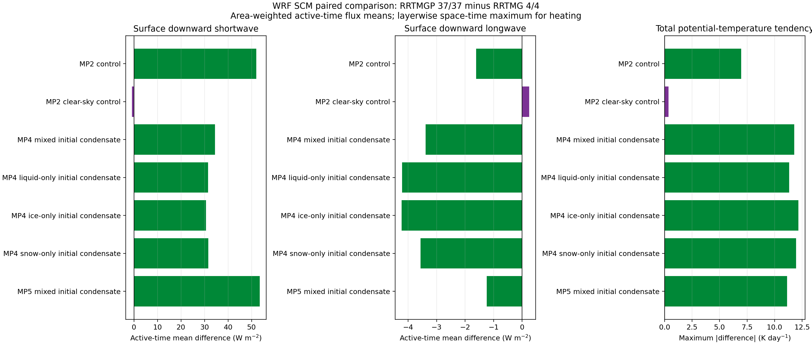

# 기존 RRTMG 4/4와 RRTMGP 37/37 비교 평가

2026-10-01, 계산 소스 `ec84e628c125480f6446c1b35775a8cfc563fe7e`의 동일 GNU serial WRF 실행 파일로 새 시험을 수행했다. **7개 조건, 총 14개 5분 실행이 모두 정상 완료했고 초기 상태·첫 구름분율·출력 시간·유한성·누적량 계약을 확인했다. 청천 차이는 작지만 구름 조건의 단파·장파 및 층별 경향 차이는 크다.** 관측이나 고정밀 기준 해법과 비교하지 않았으므로 정확도 우열을 뜻하지 않는다.

## 비교 조건과 검증

- WRF v4.8.0 기반 `em_scm_xy`, 1999-10-22 19:00–19:05 UTC, 시간 간격 10초, 복사 매 단계(`radt=0`), 이력 10초 간격 31시각.
- 유효 내부 격자는 2×2, 59개 모델층, 4 km 간격, 주기 경계. 지표 Noah(2), PBL YSU(1), 에어로졸 없음. 일반 3차원 예보 영역의 검증은 아니다.
- 조건별 `ideal.exe`로 **한 번 초기화**한 `wrfinput_d01`을 4/4와 37/37에 복사했다. 모든 변수 배열이 비트 단위로 같고, namelist는 두 복사 옵션 외에 같다. 전역 RA 속성만 각 선택값으로 바꿨다. 첫 활성 출력의 `CLDFRA`도 두 선택에서 비트 단위로 일치한다.
- 구름 fixture는 약 248.865 K의 한 층에 QC=2×10⁻⁵, QI=1×10⁻⁵, QS=3×10⁻⁵ kg/kg 중 해당 수상을 넣는다. Ferrier(5)는 등록된 QC와 통합 frozen QI만 사용한다. **‘액체만/빙정만/눈만’은 초기 상태 이름**이며 이후 미세물리가 수상을 바꿀 수 있다. 조건 사이의 구름분율도 서로 다르므로 수상별 광학 효율의 순위 시험은 아니다.
- 청천 조건은 `cldovrlp=0`으로 두 복사 엔진에서 구름 광학을 제외한다. 미세물리의 응축수 자체를 제거하는 설정은 아니다.
- 지표·TOA 플럭스는 W/m², 면적 가중 평균을 사용한다. 초기 0값 출력은 활성 평균에서 제외한다. 모든 차이는 **37−4**다. RMSE/bias는 두 구현 간 차이의 통계이고 관측 오차가 아니다.
- WRF 실행 파일 SHA256: `d9ebe0db0124229a86d14cf1a38a85f665b2fabdbe78e98f3506159b72fb59b9`. 실행·초기 배열·forcing 해시와 옵션은 `comparison.json` 및 원시 suite receipt에 저장했다. 같은 바이너리의 기존 4번 경로를 대조군으로 썼으며, 공식 수정 전 WRF와의 새 회귀 비교는 이번 평가 범위가 아니다.

## 5분 평균 플럭스

아래는 30개 활성 시각과 4개 격자점의 면적·시간 평균이다. 모든 수치는 W/m²이며 OLR은 `LWUPT`다. TOA 진단은 기존 wrapper의 모델 상단 위 대기 확장을 포함한 복사 기둥 상단으로 비교한다.

| 조건 | RRTMG 하향 SW | RRTMGP 하향 SW | Δ 하향 SW | Δ 하향 LW | Δ OLR |
| --- | ---: | ---: | ---: | ---: | ---: |
| Lin(2), 기본 구름 | 244.50 | 296.53 | +52.03 | -1.62 | +2.06 |
| Lin(2), 청천 복사 강제 | 684.95 | 684.16 | -0.80 | +0.25 | +0.61 |
| WSM5(4), 초기 혼합 수상 | 487.49 | 521.95 | +34.46 | -3.38 | +23.51 |
| WSM5(4), 초기 액체만 | 491.49 | 523.00 | +31.51 | -4.21 | +24.44 |
| WSM5(4), 초기 빙정만 | 492.34 | 523.01 | +30.67 | -4.23 | +24.18 |
| WSM5(4), 초기 눈만 | 491.05 | 522.65 | +31.60 | -3.56 | +22.75 |
| Ferrier(5), 초기 액체·통합 빙상 | 246.51 | 300.00 | +53.48 | -1.24 | +1.92 |

기본 Lin 사례에서는 지표 하향 단파가 244.50→296.53 W/m²로 증가했다. 같은 사례의 청천 진단 `SWDNBC` 차이는 −0.80 W/m²이고, 청천만 계산한 별도 적분도 −0.80 W/m²다. 따라서 큰 전천 차이는 **구름이 포함된 처리에서 나타난다**. 광학표, 크기·수분경로 변환, McICA 표본화와 적분 중 상태 변화의 기여를 각각 분리해 정량화한 결과는 아니다.

WSM5의 OLR 평균 차이는 +22.75~24.44 W/m²였다. 5분 뒤 기본 Lin 지표 SW는 230.89→284.65 W/m²이고 GLW는 282.61→280.93 W/m²다. 단일 마지막 시각과 적분 평균은 구분해야 한다.



[벡터 그림](overview.svg) · [기본 Lin 시계열](mp2-control/surface_flux_timeseries.png) · [혼합 WSM5 시계열](mp4-mixed/surface_flux_timeseries.png)

## 첫 복사 출력과 표본화

첫 활성 출력(19:00:10)의 플럭스는 초기 공통 기둥을 사용하는 첫 복사 호출에서 나온다. 이후 출력은 서로 다른 복사 경향으로 진화한 기둥을 사용한다. 아래는 첫 활성 출력의 수평 평균이며 W/m²다.

| 조건 | 첫 구름분율 최댓값 | 첫 Δ 하향 SW | 첫 Δ 하향 LW | 첫 Δ OLR |
| --- | ---: | ---: | ---: | ---: |
| Lin(2), 기본 구름 | 0.000000 | -0.52 | +0.25 | +0.94 |
| Lin(2), 청천 복사 강제 | 0.000000 | -0.52 | +0.25 | +0.94 |
| WSM5(4), 초기 혼합 수상 | 0.094855 | +80.27 | +12.91 | -12.69 |
| WSM5(4), 초기 액체만 | 0.029921 | -4.68 | +1.49 | +2.33 |
| WSM5(4), 초기 빙정만 | 0.018222 | -4.43 | -0.69 | +3.62 |
| WSM5(4), 초기 눈만 | 0.052945 | +42.16 | +5.36 | -3.48 |
| Ferrier(5), 초기 액체·통합 빙상 | 0.046756 | +26.27 | +5.35 | -3.00 |

부분 구름 사례는 첫 분율이 약 0.018~0.095이고 격자점이 4개뿐이다. 이 첫 출력 차이에 McICA 표본오차가 포함된다. 기존 RRTMG는 `irng=0`에서 하부 층 압력의 소수부로 KISS 난수 상태를 만들므로 동일 압력의 기둥에는 같은 표본이 반복될 수 있다. 이번 초기 균일 사례의 4번 플럭스 공간 표준편차가 0인 것을 독립 표본의 불확실성이 0이라는 뜻으로 해석하면 안 된다. 37번은 `(i,j,day)` 시드를 사용한다.

출력 JSON의 공간 표준편차와 SE 형식의 값은 설명용이다. 독립 격자 표본 가정을 검증하지 않았으므로 신뢰구간·정확도 판정에 쓰지 않는다. 향후 양쪽 엔진에서 독립 시드를 명시적으로 변화시킨 같은 prepared-input 기둥 시험이 필요하다.

## 층별 복사 경향

`RTHRATLW/SW/EN`의 원래 단위는 **온위 경향 K/s**다. 86400을 곱해 아래 표와 그림을 온위 K/day로 표시했다. Exner를 곱한 실제 기온 가열률과 구분한다. 표는 활성 시각·모든 층·모든 격자에서 최대 절대차이며 수직 평균이 아니다.

| 조건 | 장파 경향 최대 절대차 | 단파 경향 최대 절대차 | 합계 경향 최대 절대차 |
| --- | ---: | ---: | ---: |
| Lin(2), 기본 구름 | 7.381 | 2.172 | 6.967 |
| Lin(2), 청천 복사 강제 | 0.310 | 0.118 | 0.357 |
| WSM5(4), 초기 혼합 수상 | 9.734 | 3.458 | 11.788 |
| WSM5(4), 초기 액체만 | 8.498 | 3.547 | 11.320 |
| WSM5(4), 초기 빙정만 | 8.980 | 3.623 | 12.158 |
| WSM5(4), 초기 눈만 | 9.102 | 3.541 | 11.948 |
| Ferrier(5), 초기 액체·통합 빙상 | 11.797 | 2.261 | 11.133 |

청천의 합계 최대차는 0.357 온위 K/day, 구름 사례에서는 최대 12.158 온위 K/day였다. 이는 하루 적분한 온위 오차를 뜻하지 않는다. 실제 5분 말 대기 온위(`T+300`)의 최대 차이는 0.0364 K 이하였다. 구름층 부근의 국소 경향 차이는 후속 장시간 적분에서 따로 평가해야 한다.

[기본 Lin 층별 경향](mp2-control/heating_profiles.png) · [혼합 WSM5 층별 경향](mp4-mixed/heating_profiles.png)

## 누적 에너지와 구름 효과

`ACSWDNB`와 `ACLWDNB`는 양수 여부에 그치지 않고 **모든 10초 구간에서** 다음 WRF 누적 계약을 검사했다.

```text
A[n] - A[n-1] = F[n] × 10 s
```

총 28개 조건별·선택별·단/장파 검사가 모두 단정도 ULP 허용오차 안에 통과했다. 전체 최대 구간 잔차는 0.007934570 J/m²였다. 기본 Lin의 누적 에너지 차이는 SW +15,607.90 J/m², LW −484.77 J/m²이고 300초 평균 차이는 각각 +52.02634, −1.61589 W/m²다. 이 조건에서 이중·누락 누적의 증거는 없으며 restart나 다른 복사 주기는 아직 시험하지 않았다.

구름 효과(CRE)는 각 엔진 안의 전천−청천으로 계산한다. 지표 하향 SW/LW 및 TOA 순하향 `(down-up)` CRE를 따로 저장했다. 진화한 기둥 사이의 CRE 차이도 서로 다른 미세물리·열역학 상태 영향을 포함한다. `SWDDIR`는 각 solver의 delta-scaled direct 분해로 비교하며 관측 DNI/비산란 직달과 동일하다고 가정하지 않는다.

## 해석과 미완료 범위

RRTMG와 RRTMGP는 같은 WRF 초기 상태를 받아도 구름 입력과 광학이 같지 않다. 이 구성의 기본 4번은 iceflag=3에서 qi+qs를 함께 ice path로 처리하며 분율 0.01 바닥값과 Fu 크기 변환을 사용한다. 37번은 전용 builder에서 양의 정확한 분율로 각 수상 경로를 만들고 ice/snow 반경을 직경으로 변환한다. 이번 MP2/4/5에서 별도 눈 반경을 직접 공급하지 않았으므로 **flag5의 0.99 눈 질량계수나 130 μm 큰 눈 보정이 이 차이를 만들었다고 단정하지 않는다.** 37번 snow는 ice-radius proxy를 사용한다.

기체 계수도 다르다. 현재 RRTMG는 LW 140/SW 112 g점이고 37번은 LW 128/SW 112 g점이다. 37번의 6기체에 legacy LW의 CFC/CCl4가 포함되지 않는다. 따라서 이 비교는 전체 WRF 복사 옵션의 결과 비교이며 동일 광학 입력에 대한 solver-only 정밀도 시험이 아니다.

큰 격자에 동일 SCM 기둥을 복제한 16×16 첫 단계 탐색에서는 **4번과 37번 모두** 온도·압력·수증기·질량 및 합계 경향에 NaN이 생겼다. WRF 성공 문구만으로 정상 적분으로 판단하지 않았고 이 탐색을 유효 통계에서 제외했다. 별도 실패 기록은 [failed-extension.json](failed-extension.json)에 있다. 원인을 확정하지 않았으며 37번만의 버그로 해석할 근거도 없다. 큰 격자 복제는 legacy 압력 시드의 독립 표본을 늘리는 방법도 아니다.

이 평가에는 관측 검증, 독립 양쪽 엔진 구름 앙상블, 24–48시간 실제 예보, MPI/OpenMP, restart, 둥지, tile packing 및 성능 benchmark가 없다. **청천의 근접성과 정상 실행은 확인했지만 구름 복사의 일치나 예보 정확도 우열은 아직 입증되지 않았다.** 우선 다음에는 양쪽 cloud optics 입력을 함께 저장한 독립 시드 기둥 비교와 실제 예보의 동일 초기조건 비교가 필요하다.

## 재현

등록된 GNU serial `em_scm_xy` 실행 파일과 NumPy·netCDF4·Matplotlib가 필요하다. NetCDF가 비표준 위치에 있으면 `LD_LIBRARY_PATH`를 지정한다. 출력 경로는 새 디렉터리여야 한다.

```bash
python3 tools/compare_radiation_scm.py \
  --output-directory build/new-radiation-comparison
python3 tools/analyze_radiation_comparison.py \
  --suite build/new-radiation-comparison/receipt.json \
  --output-directory build/new-radiation-analysis
```

[실행 도구](../../../tools/compare_radiation_scm.py) · [분석 도구](../../../tools/analyze_radiation_comparison.py) · [전체 수치 JSON](comparison.json) · [지표별 CSV](comparison_metrics.csv)
