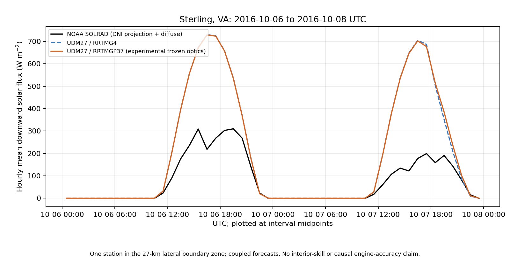

# UDM27: 48-hour SOLRAD boundary-site comparison

This package adds an observed surface-SW comparison to the completed Matthew DT60 paired forecasts. **Both radiation configurations substantially overpredict the observed downwelling solar flux at Sterling.** Their difference is small relative to that shared error. This is a descriptive result at one lateral-boundary site, not evidence that either configuration has validated forecast skill or that all 4/37 differences are normal.

| Primary comparison | UDM27 / RRTMG4 | UDM27 / RRTMGP37 |
|---|---:|---:|
| All 48 hours: bias (W m⁻²) | +118.0924 | +119.1415 |
| All 48 hours: RMSE (W m⁻²) | 211.7299 | 211.6403 |
| 24 daylight hours: bias (W m⁻²) | +235.2779 | +237.3762 |
| 24 daylight hours: RMSE (W m⁻²) | 299.4299 | 299.3032 |
| Full-window model energy (MJ m⁻²) | 33.917168 | 34.098460 |

Observed full-window energy is 13.510803 MJ m⁻². The mean RA37−RA4 difference is +1.0491 W m⁻² over all hours and +2.0983 W m⁻² over daylight hours. The small RMSE reduction for 37 does **not** establish an improvement: its bias and MAE increase, the hours are temporally correlated, and the station is in a boundary zone. The separately reported global-PSP channel gives the same qualitative shared overprediction; it is not substituted into the primary estimate.



## Observation and time contract

The NOAA SOLRAD records are one-minute, period-end means. The analysis includes `(2016-10-06 00:00 UTC, 2016-10-08 00:00 UTC]`: 2,880 samples in 48 complete hours. Three daily files are necessary because the final midnight sample is in the October 8 file. All direct, diffuse and global solar QC flags in these files are zero. Raw signed values, including negative nighttime offsets, remain unchanged.

The primary reference is `DNI * max(cos(supplied SZA), 0) + DHI`, following NOAA's preference for the direct/diffuse estimate over the backup global PSP. Only the below-horizon **direction projection** is zeroed; measured irradiances are not clipped. The supplied central-period SZA is used as recorded. This is a minute-mean measurement estimate, not a claim that a product of averages exactly integrates instantaneous irradiance. Any missing minute or failed component QC makes that primary hour unavailable; there is no interpolation or PSP fallback. Global PSP is scored separately. A daylight hour has at least 30 observed minutes with SZA <90°, fixed before scoring.

The model reference is `ΔACSWDNB / 3600`, in W m⁻². Hourly instantaneous `SWDOWN` is retained in the model extract for inspection and is **not** scored against hourly observed means. Accumulators are stored as float32; subtraction is performed after promotion to float64 and cannot recover original storage quantization. The extract binds all 49 UTC records and the two original history SHA256 values. It does not replace a native-history readback when the full files are available.

## Site selection and boundary limitation

The three geometrically eligible SOLRAD sites were considered before scores were calculated. Oak Ridge and Tallahassee files returned HTTP 403 in the bounded, single-attempt campaign. The NOAA 2016 summary report independently lists their operating end dates as 2007-06-08 and 2002-10-30. They are excluded rather than treated as 2016 observing sites. The listed SURFRAD stations are outside this model domain and are excluded rather than matched to an edge cell.

Sterling's daily headers exactly match the post-2014 site: 38.97203°N, 77.48690°W, elevation 85 m. The nearest actual WRF land cell is zero-based `(j,i)=(96,36)`, or one-based `(97,37)`, 9.0061 km away, with HGT 101.0 m. The grid spacing is 27 km. There are **two cells to the northern edge**, inside the configured `spec_bdy_width=5` zone. This cannot establish interior forecast skill. Point/cell representativeness, terrain, instrument spectral coverage and measurement offsets also differ.

## Exact model scope

The existing two runs cover 2016-10-06 00 UTC through 2016-10-08 00 UTC at DT60, 4 MPI ranks ×2 OpenMP threads, UDM27, `cu_physics=1`, CU radiation feedback, `radt=10 min`, batch size 32. RA37 uses **experimental frozen-optics mode 1**, expanded table SHA256 `ebeafb9746164d5414a45eab4061c5c855f0f91e92be77003b3829722514fe6a`. Both runs use executable SHA256 `17e37d7461d90bf4eac4110879ecf4716e515fd155aca9754ff74d573ca01725`, the PR65-era build explicitly predating later guards. This is not a new run of the latest tree or a validation of default hail/graupel policy.

`forecast-plan.json` preserves its prelaunch status; the terminal `forecast-execution-receipt.json` establishes that both runs actually completed and passed their scoped numerical validation. This package launches **zero new WRF, REAL, build or radiation-solver calls** and changes no production code/defaults.

These are coupled trajectories, not synchronized same-state engine calculations. The shared observation error cannot be assigned to cloud fraction, optics, input/boundary forcing, transport or microphysics from this comparison alone. No longwave instrument is present at this site, no TOA observations are used, and the RTE delta-scaled direct field is not compared with observed DNI. Physical accuracy, independent interior sites/events, ice-size metric provenance and frozen-precipitation model assumptions remain open.

## Reproduction

With Python 3 and NumPy:

```sh
python3 verify.py
python3 analyze.py
python3 test_time_qc_contract.py
```

`verify.py` checks the closed file roster and byte pins, then reproduces the CSV and results in a temporary directory from the shipped raw observations and model extract. It does not regenerate the original forecast, reopen its two approximately 1-GB histories, or prove the scientific truth of the optics. With local original histories and netCDF4 installed, `analyze.py --extract-from-pair /path/to/udm37-matthew-dt60-paired-48h-v1` reopens and checks their recorded hashes. `plot_comparison.py` additionally requires Matplotlib. `fetch_once.py` documents the original bounded download; the existing download manifest prevents repeated campaign execution.

## Primary sources

- [NOAA SOLRAD README](https://gml.noaa.gov/aftp/data/radiation/solrad/README_SOLRAD.txt): format, period-end timestamps, QC, signed offsets and recommended irradiance estimate. Its general timestamp examples retain older three-minute wording; the explicit 2015+ cadence and actual minute records determine this campaign's one-minute intervals.
- [SOLRAD network](https://gml.noaa.gov/grad/solrad/): site coordinates, Sterling relocation and 2015 cadence notice. A coordinate listing alone is not proof of operation in 2016.
- [NOAA GMD 2016 report, Table 7-3](https://gml.noaa.gov/publications/summary_reports/summary_report_28.pdf): station operating periods.
- [Sterling 2016 dataset](https://gml.noaa.gov/data/dataset.php?item=ste-solrad-2016): official data provenance and CC0 license.
- [NOAA reported data problems](https://gml.noaa.gov/grad/solrad/problems.html): the archived page concerns Seattle's earlier wiring issue; no correction is inferred for Sterling.

Raw public NOAA data, downloaded metadata/documents, failed-attempt records, model extraction/provenance, scoped independent review and analysis code are retained together. The full native histories are identified by hashes and are not bundled.
