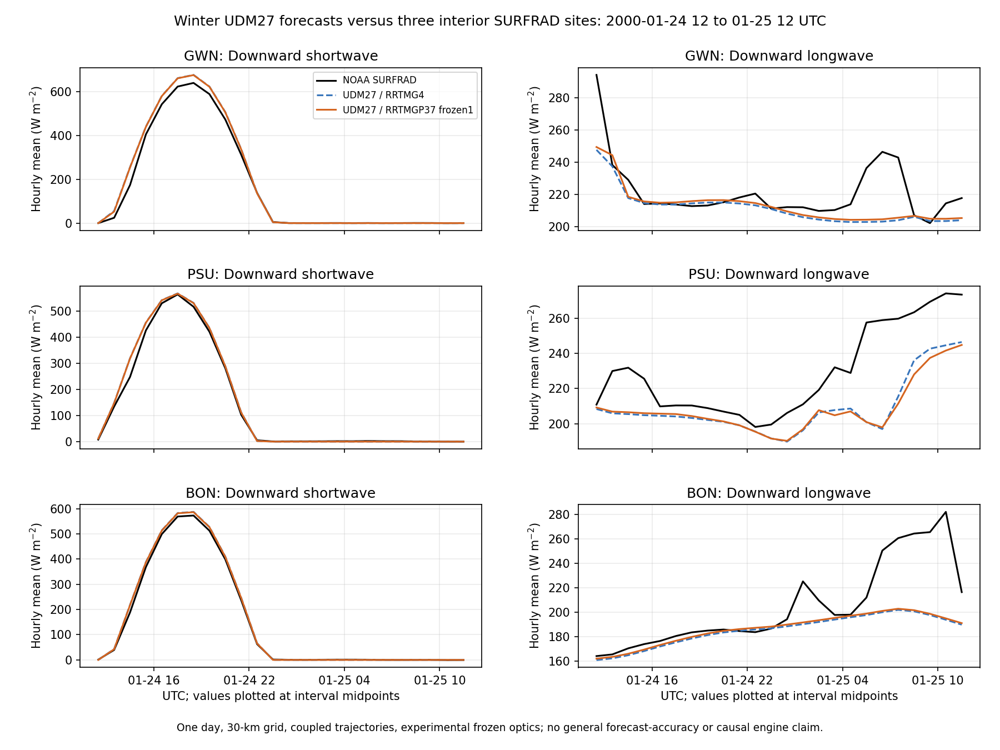

# UDM27: full-day RRTMG4/RRTMGP37 comparison with three interior SURFRAD sites

This comparison uses the completed, matched 24-hour winter forecast pair, rather than the older RRTMGP run that stopped after two hours. Both terminal receipts report return code 0 and completion through 2000-01-25 12 UTC. The earlier negative-QI failure and its separate history remain documented in `runtime-inventory.json`.

The observational differences between radiation configurations are small for this event. Both configurations still have observational biases, and Penn State downward-longwave RMSE is larger with option 37. These results do not establish a general winner, demonstrate that all remaining RRTMG/RRTMGP differences are physically correct, or validate the latest/default production configuration.

## Scope and inputs

- Window: 2000-01-24 12 UTC to 2000-01-25 12 UTC; 25 native hourly history records per arm.
- UDM27, 73 × 60 horizontal cells, 32 native layers, Lambert grid, 30 km, DT=60 s, radiation interval 10 min, MPI4/OMP1, cumulus option 1 with radiation feedback, `use_mp_re=1`.
- Option 37 uses **experimental frozen optics mode 1**, roughness category **1**, and frozen table SHA256 `8cb00850c3f885f5ec0306563c1ec0a55b512478a7395d626c1c99cebf280583`. Option 4 uses frozen mode 0. This is a configuration comparison, including differing radius/optics treatment; it is not a same-input radiation-engine accuracy experiment.
- Shared initial-file SHA256 `0cc7e188ef585a93ab52550816c6af236932254820fb1bc6937f464bfed38637`; shared boundary-file SHA256 `ba4241de4f4661a77733cf157f0c87f90668f107df86f8c92d092b56d7bd7bd4`.
- Shared executable SHA256 `3f868da917910ad1be5b1fed9e603c588c56936edebdc1bd7906d54113fe0b9c`. This is the **earlier seaice-fix build**, not a new latest-tree build. Original build receipt `BUILD_FAIL_PRESERVED` is retained: its harness wrongly required four generated guards when only three active CPP branches remained. The additive `BUILD_PASS_POSTHOC_ATTESTED` receipt explains the branch-aware correction without rebuilding or changing executable/source bytes.
- The inventory separately records a later MPI4/OMP2 option-37 batch-32 run whose history has the same SHA256. That does not provide an OMP2 option-4 counterpart or turn this into a same-build OMP2 paired assessment.
- This analysis reused existing outputs and observations: **zero new forecasts, REAL runs, builds, radiation-solver calls, or observation downloads**.

## Location and time contracts

| Site | WRF (i,j), one based | Nearest-edge distance, cells | Station/grid distance | Grid minus station elevation |
|---|---:|---:|---:|---:|
| Goodwin Creek (GWN) | (11,24) | 10 | 9.73 km | −13.71 m |
| Penn State (PSU) | (41,53) | 7 | 11.05 km | −16.73 m |
| Bondville (BON) | (13,46) | 12 | 12.26 km | +8.81 m |

All are land cells outside `spec_bdy_width=5`. Being outside the relaxation strip does not establish independence from lateral forcing. Nearest spherical-distance selection was recomputed on both histories; no interpolation or terrain correction was fitted. Comparing point observations with a 30-km grid also introduces representativeness error. Official site metadata: [Goodwin Creek](https://gml.noaa.gov/grad/surfrad/goodwin.html), [Penn State](https://gml.noaa.gov/grad/surfrad/pennstat.html), [Bondville](https://gml.noaa.gov/grad/surfrad/bondvill.html).

The six unmodified daily NOAA files provide 2,880 three-minute records; 1,440 interval ends fall in the scored window, 480 per site. Each hourly bin uses exactly 20 QC0 records in `(start,end]`, beginning at 12:03 and ending at next-day 12:00 UTC. Incomplete, nonfinite, sentinel, or bad-QC bins are rejected; no imputation or fallback is used. Signed QC0 fluxes are preserved, including negative nocturnal values.

Primary downward SW is `DNI × max(cos(SZA),0) + diffuse`, following NOAA's preferred component estimate; primary LW is measured downward infrared. The reported central three-minute solar zenith angle is used as supplied, so projected period means are an estimate of the instantaneous integral. PSP global SW and PSP-based net SW remain separate secondary diagnostics. This explicitly differs from the older partial comparison's PSP primary reference. A daylight hour requires at least ten of its twenty solar zenith angles below 90 degrees, chosen before scoring.

Model hourly means use successive native `ACSWDNB`, `ACSWUPB`, and `ACLWDNB` differences divided by 3,600 s. Native float32 storage quantization is retained, with subtraction in float64. `ACSWDNBC` and `ACLWDNBC` provide model all-minus-clear diagnostics; these are not observed cloud properties or independent radiative-accuracy references.

[NOAA archived format documentation](https://gml.noaa.gov/aftp/data/radiation/surfrad/psu/README_SURFRAD.txt) and [problem notices](https://gml.noaa.gov/grad/surfrad/problems.html) are byte-pinned locally. The archived upward-IR calibration correction is already incorporated; later PSU direct/diffuse and tower problems postdate this window. UVB corrections do not affect the scored broadband channels. No additional calibration adjustment was applied.

## Descriptive results

Bias is model minus observation; all values below are W m−2 and use all 24 matched hourly bins per site. RMSE includes night, so it should not be compared directly with daytime-only scores. Complete daytime and secondary-reference metrics are in `results.json`.

| Site / channel | RA4 bias | RA37 bias | RA4 RMSE | RA37 RMSE | Mean RA37−RA4 |
|---|---:|---:|---:|---:|---:|
| GWN / downward SW | +14.542 | +14.069 | 25.935 | 25.303 | −0.472 |
| PSU / downward SW | +6.907 | +6.596 | 17.113 | 16.761 | −0.311 |
| BON / downward SW | +5.369 | +4.944 | 9.957 | 9.343 | −0.425 |
| GWN / downward LW | −10.002 | −8.437 | 17.588 | 16.832 | +1.565 |
| PSU / downward LW | −20.169 | −20.790 | 25.645 | 26.684 | −0.621 |
| BON / downward LW | −19.622 | −18.374 | 32.408 | 31.754 | +1.248 |

There are ten daylight hourly bins per site. Daytime SW bias is RA4/RA37 +35.405/+34.286 at GWN, +18.255/+17.518 at PSU, and +13.555/+12.536 at BON. Similar model traces do not imply agreement with observations. In particular, BON model LW all-minus-clear means are only +0.00280/+0.00255 W m−2 while both forecasts underpredict observed LW. This identifies a useful diagnostic target but does not prove an observed-cloud omission, a port bug, or its cause; thermodynamics, cloud state, and forcing must be examined independently.



These are coupled trajectories, so their difference includes state feedback as well as configuration/engine effects. One event and three correlated sites cannot support statistical significance, climatological skill, or a universal ranking. No tolerance or source physics was adjusted to improve scores.

## Reproduce and inspect

```sh
python3 validation/rrtmgp37/surfrad-interior-full24h/verify.py
```

Python 3 with NumPy suffices for the offline closed-roster checks and exact reanalysis from the bundled three-site accumulator extraction and raw observations. The verifier also reruns four parser/reducer tests and eight component/LW time-QC controls. Full NetCDF histories (about 386 MB combined), model executable, forcing, and coefficient files are not bundled; their source paths and hashes are recorded. Thus the portable verifier confirms packaged reduction and provenance linkage, not an independent re-extraction from unavailable histories.

For a machine with those histories, `analyze.py --extract-from-pair /path/to/udm-seaice-winter-validation-v3` additionally requires netCDF4 and re-extracts the source values. Use a separate copy of this package when doing so: recorded absolute provenance paths change if the source pair is relocated. `plot.py` additionally requires Matplotlib and exports the standalone PNG; the PNG is byte-pinned, without a cross-version plot-byte reproducibility claim.

The independent review read the native histories and raw NOAA files through a separate implementation: all 360 arm statistics, 30 pair means, 750 native accumulator values, and 12 model cloud-effect means match exactly; 12 missing/QC/fill/duplicate/signed-data controls pass. `independent-review-v1.json` preserves the original three-field snapshot, and `independent-review-v2.json` checks the final five-field version. This is scoped numerical/provenance agreement, not physical accuracy certification.

`receipts/` preserves terminal execution, staging, original build failure, additive build attestation, source freeze, and the prelaunch runtime manifest. Terminal execution receipts determine actual completion; the prelaunch manifest's readiness wording is not substituted for completion evidence. `manifest.json` fixes the entire evidence roster and SHA256 values.
