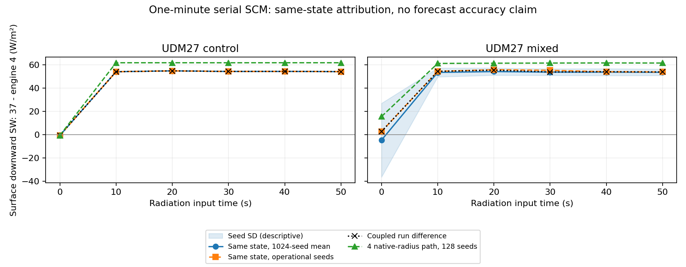

# UDM27 동일 상태 RRTMG4–RRTMGP37 물리 감사

검토·개발 기준은 `1a2cd8d11993a5fb829a5103c0775ff69f820244`이며, 2026-10-02 GNU 13.3 직렬 SCM에서 실행했다. 이번 변경은 UDM CF 진단과 별도 scratch 계산을 추가한다. 운영 CLDFRA, 강수 매핑, McICA seed, 반경·상수 설정을 새로 선택하지 않는다.

**약 +45 W/m²의 1분 평균 SWDOWN 차이를 빠른 coupled 피드백 또는 표본 잡음으로 설명하는 해석은 control 사례에서 지지되지 않는다.** 같은 순간의 실제 WRF 상태를 두 wrapper에 넣어도 첫 구름 발생 이후 약 +54 W/m²가 남는다. UDM 반경 입력을 RRTMG4에도 켠 대조 계산에서는 약 +62 W/m²가 남는다. 따라서 반경 입력 차이만으로도 설명되지 않는다. 이번 시험에서 연결·단위 변환·계산 재생의 새 결함은 확인하지 못했지만, 남은 큰 차이 전체를 정상적이고 정확한 물리 차이라고 확정하지는 않는다.

## 실제 상태의 비교

1분, 시간 간격 10초인 control/mixed SCM을 사용했다. LW/SW 각각 6회 호출의 원래 입력 시각은 0–50초다. history는 대응하는 시간 단계 종료 후 10–60초 출력을 사용한다. 두 엔진의 scratch 입력은 37 적분의 같은 `x37(t)`이며 RRTMG4는 실제 wrapper와 원래 반경 플래그·기본 seed를 사용한다. 1,024개 결정론적 seed를 대응시킨 평균과 차이의 SD도 계산했다. 대응 seed가 동일한 마스크나 독립·동일분포 난수를 뜻하지 않는다.

control의 표면 하향 단파 차이(37−4, W/m²)는 다음과 같다.

| 입력 시각(초) | coupled 차이 | 같은 상태 운영 seed | 1,024-seed 평균 | seed 차이 SD | 반경 입력을 켠 4 대조: 128-seed 평균 |
|---:|---:|---:|---:|---:|---:|
| 0 | −0.51904 | −0.51904 | −0.51904 | 0 | −0.51904 |
| 10 | +54.15176 | +54.15207 | +54.15207 | 0 | +61.85330 |
| 20 | +54.90802 | +54.90558 | +54.90558 | 0 | +61.86050 |
| 30 | +54.38010 | +54.37741 | +54.37741 | 0 | +61.84424 |
| 40 | +54.41528 | +54.41083 | +54.41083 | 0 | +61.86426 |
| 50 | +54.23764 | +54.22891 | +54.22891 | 0 | +61.85718 |

control의 coupled 차이와 같은 상태 운영-seed 차이의 잔차는 최대 0.00873 W/m²다. 이후 상부 빙정층은 radiation CF=1이어서 seed를 바꿔도 구름 마스크가 변하지 않는다. 첫 무구름 계산의 근접성은 이후 구름 광학의 근접성을 보장하지 않는다. 이 사례의 기존 약 +45.26 W/m² 평균은 첫 약 0의 차이와 이후 약 +54의 차이를 함께 평균한 값이다.

mixed에서는 첫 호출의 같은 상태 ensemble 차이가 −4.603 W/m², 차이 SD가 31.672 W/m²이며 실제 운영-seed 차이는 +2.790 W/m²다. 이후 5회 평균 차이는 +53.55–54.29 W/m², 차이 SD는 2.77–3.82 W/m²다. mixed의 coupled−같은 상태 운영-seed 잔차 최대 절댓값은 1.454 W/m²다. 두 사례의 모든 LW/SW 진단과 시점은 [validation.json](validation.json)에 보존했다.

이 잔차는 선택한 `x37(t)`에서의 정확한 대수적 차이이며, 모든 실험에서 유일한 물리·피드백 분해가 성립한다는 뜻은 아니다. 반경 대조는 동일한 37 상태의 실제 UDM 진단 반경을 RRTMG4에 전달한다. 미세물리 첫 실행 전에는 배경값이며, 이후에는 UDM native 값이다. 기존 RRTMG 입자 변환·snow 보정까지 포함하는 입력 경로 대조이므로 완전히 동일한 광학 입력을 맞춘 시험은 아니다.



## UDM 내부 CF와 radiation CF

UDM이 실제 사용한 CF와 source step을 `UDM_CLDFRA/UDM_CF_STEP`으로 내보내고, raw capture에는 `UDM_CF_USED`와 현재 상태에서 재계산한 `UDM_CF_RECOMPUTED`를 따로 기록했다. 실제 UDM은 길이 척도 10,000 m를 소스에서 고정한다. 내부 `ktop` 위에서 초기 CF=1이 유지되는 사실도 보존한다. UDM 진단을 실행하지 않은 열은 −1 sentinel이며 유효한 zero CF로 해석하지 않는다.

선택한 호출 2·6, LW/SW의 8개 실제 컬럼을 32개 seed로 재생했다. A는 운영 CF/path, B는 마지막 실제 UDM CF, B_now는 현재 상태의 재계산 UDM CF, C는 운영 CF 아래 grid-mean path를 직접 넣는 비보존 대조다. 모델 상단에 추가된 44개 대기층은 모든 변형에서 보존했다.

SW의 A 대비 표면 하향 단파 평균 변화(W/m²)는 다음과 같다. 이는 고정 상태의 진단 민감도이며 새 기본값을 권하는 결과가 아니다.

| 사례·호출 | B: 마지막 실제 UDM CF | B_now: 현재 재계산 CF | C: grid path 직접 사용 |
|---|---:|---:|---:|
| control·2 | −0.027 | +92.63 | 0 |
| control·6 | +93.04 | +93.46 | 0 |
| mixed·2 | +28.98 | +88.71 | +2.81 |
| mixed·6 | +90.85 | +91.26 | +1.65 |

CF가 0이면 표현할 수 없는 질량을 별도로 보고한다. B와 B_now는 진단 시점·층 범위가 달라 같은 입력으로 취급할 수 없다. CF 교체는 큰 영향을 줄 수 있지만 현재 같은 상태 4/37 비교는 같은 radiation CF를 사용한다. 따라서 이 민감도를 기존 +54 W/m² 차이의 원인이라고 곧바로 해석하지 않는다. [counterfactual-summary.json](counterfactual-summary.json)에 평균·SD·상별 생략량을 보존했다.

## SW delta 정책과 graupel

정책 1은 현재 `D(C)+D(P)`, 정책 2는 고정 CCPP의 `C+D(P)`, 정책 3은 대조 `D(C+P)`다. D는 delta-Eddington 변환이며 C/P는 cloud 및 rain/snow 광학이다. 실제 4개 SW 캡처의 A·graupel 제외 조건에서 정책 2−1의 최대 절댓값은 하향 단파 1.45440 W/m², TOA 상향 0.484761 W/m², 최대 절댓값 가열률 지표 0.466764 K/day였다. 정책 3−1은 각각 0.000350 W/m², 0.000136 W/m², 4.07×10⁻⁷ K/day 이하였다. 여기서 가열률 숫자는 `max|HR|` 지표의 변화이며 `max|HR2−HR1|`와 다르다. 현재 큰 4/37 표면 플럭스 차이는 이 delta 정책 차이만으로 설명되지 않는다.

control의 graupel은 0이다. mixed의 선택 열 grid graupel 합은 호출 2에서 0.00981533 g/m², 호출 6에서 4.79547×10⁻⁶ g/m²였다. native snow 반경을 유지하고 qg를 snow path에 더한 대조에서 SW 표면 변화는 0.00373 W/m², LW는 0.000674 W/m² 미만이었다. **graupel이 거의 없는 이 사례로 graupel 광학의 중요성이나 snow 합산 정책의 정확성을 검증하지 않는다.** 별도 graupel-rich 사례가 필요하다.

9개 성분 조합 × roughness 1/2/3 × mu0 0.2/0.5/0.9 × 세 delta 정책의 합성 컬럼도 실행했다. 합성 graupel은 임의 가정이며 예보 오차율로 해석하지 않는다. 결과는 [synthetic-delta-summary.json](synthetic-delta-summary.json)이다. 운영 qg 제외 및 양의 qh fatal 정책은 유지했다. qg 제외 로그만 층별 출력에서 wrapper/tile/call 합계로 바꿨다.

## 검증과 재생

| 검증 | 결과 |
|---|---|
| Registry·독립 core | PASS |
| standalone CTest | 48/48 PASS |
| generated WRF 객체 정리 후 GNU serial em_scm_xy 빌드 | PASS |
| audit OFF/ON, control/mixed | 각 210개 history 배열 bitwise 동일 |
| 기존 pre-PR7 포팅의 UDM4 저장본 | 각 208개 배열 bitwise 동일 |
| PR7 UDM37 저장본 | 각 208개 공통 배열 bitwise 동일 |
| 모든 호출의 독립 input/optics/mask/RTE/WRF 경향 재생 | 24개 캡처 PASS |
| 8개 선택 컬럼의 A·graupel 제외·policy 1 | 생산 계산과 독립 재생 PASS |
| 새 native4 대조 128 seeds 및 최종 기본 모드 32 seeds | history·baseline·재생 PASS |
| 기존 UDM SCM gate·qg·negative-qg·hail 시험 | PASS |

4/4 회귀 기준은 과거 포팅 실행파일의 저장본이며 공식 pristine WRF 실행 비교가 아니다. 독립 재생은 production adapter/input builder를 호출하지 않지만 같은 고정 RTE/RRTMGP 코어와 계수, 같은 출처의 강수 식을 사용한다. 따라서 포팅 계약 검증이며 독립 분광모델 또는 관측 정확도 검증은 아니다. 24–48 h 예보, MPI/OpenMP, restart/nest, hail/graupel-rich 상태, 시간 seed 정책은 미검증이다.

[selected-captures.tar.gz](selected-captures.tar.gz)에 두 초기 WRF 상태와 선택 캡처를 넣었다. 압축 파일의 `seeds/control,mixed`는 입력 두 파일, `captures/control,mixed`는 LW/SW 호출 2·6의 input/raw/result 묶음이다. 계수 파일은 저장소 WRF/run 자료를 사용한다. 예:

```sh
mkdir -p build/audit-evidence
tar -xzf validation/rrtmgp37/udm-physics-audit/selected-captures.tar.gz -C build/audit-evidence
python3 WRF/test/rrtmgp/test_udm_physics_audit.py build/reproduce-audit --seeds 1024 \
  --control-state build/audit-evidence/seeds/control --mixed-state build/audit-evidence/seeds/mixed \
  --reference-executable build/cloud-column-check/reference_column
python3 WRF/test/rrtmgp/test_udm_cf_replay.py WRF/run build/cloud-column-check/reference_column \
  build/audit-evidence/captures/control/sw_000006.input \
  build/audit-evidence/captures/control/sw_000006.raw \
  --seeds 32 --cf-policy all --delta-policy all --graupel-policy all --output build/replayed-cf.json
```

구현·정책 정의는 [PHYSICS_AUDIT.md](../../../WRF/doc/rrtmgp/PHYSICS_AUDIT.md)를 따른다. 이번 단계에서 배제할 수 있는 것은 control의 지배적인 표본잡음·빠른 피드백 설명과 단일 반경 입력 오류 설명이다. 남은 빙정 광학 모델·입자 정의 차이를 동일 광학량으로 맞춘 비교와 관측으로 확인하기 전에는 큰 차이에 정확성 판정을 붙이지 않는다.
